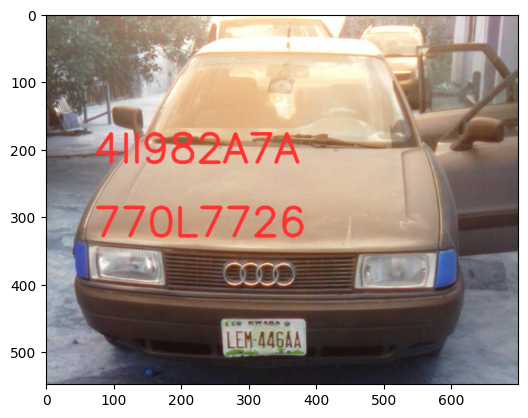
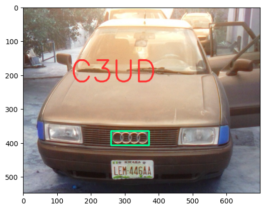
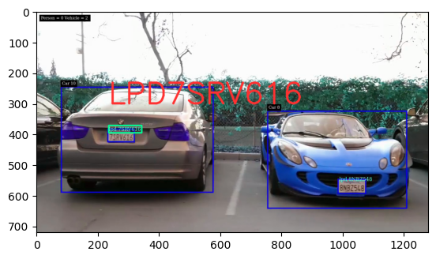
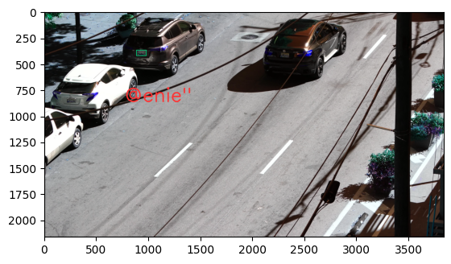
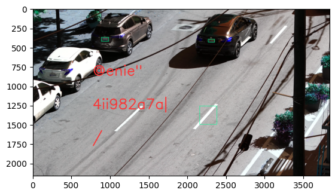
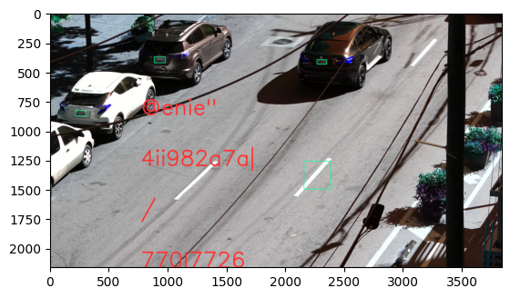
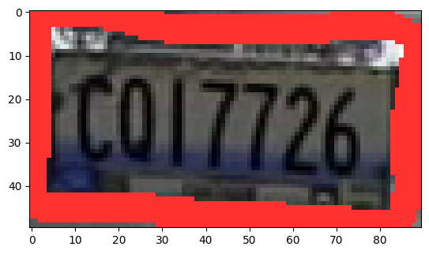
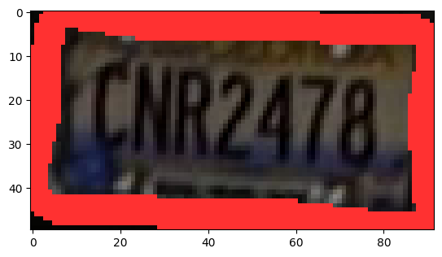
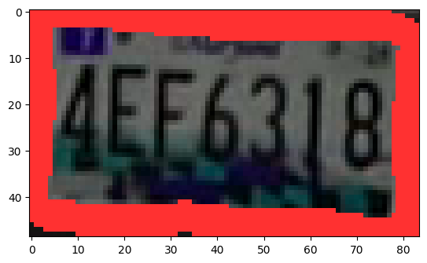
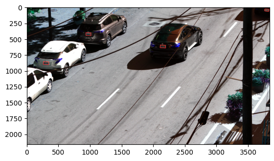

# License Plate Detection Tutorial

<table align="left">
  <td>
    <a target="_blank" href="https://colab.research.google.com/github/georgia-tech-db/license-plate-recognition/blob/main/README.ipynb"> Run on Google Colab</a>
  </td>
  <td>
    <a target="_blank" href="https://github.com/georgia-tech-db/license-plate-recognition/blob/main/README.ipynb"> View source on GitHub</a>
  </td>
  <td>
    <a target="_blank" href="
    https://raw.githubusercontent.com/georgia-tech-db/license-plate-recognition/main/README.ipynb"> Download notebook</a>
  </td>
</table>
<br>
<br>

### Install Application Dependecies 


```python
!wget -nc https://raw.githubusercontent.com/georgia-tech-db/license-plate-recognition/main/requirements.txt
!pip -q install -r requirements.txt
```

    File ‘requirements.txt’ already there; not retrieving.
    
    
    [notice] A new release of pip available: 22.2.2 -> 22.3.1
    [notice] To update, run: pip install --upgrade pip


### Start EVA server

We are reusing the start server notebook for launching the EVA server.


```python
!wget -nc "https://raw.githubusercontent.com/georgia-tech-db/eva/master/tutorials/00-start-eva-server.ipynb"
%run 00-start-eva-server.ipynb
cursor = connect_to_server()
```

    File ‘00-start-eva-server.ipynb’ already there; not retrieving.
    
    nohup eva_server > eva.log 2>&1 &
    
    [notice] A new release of pip available: 22.2.2 -> 22.3.1
    [notice] To update, run: python -m pip install --upgrade pip
    Note: you may need to restart the kernel to use updated packages.


### Register OCR Extraction UDF


```python
!wget -nc "https://raw.githubusercontent.com/georgia-tech-db/license-plate-recognition/main/ocr_extractor.py"
cursor.execute("DROP UDF OCRExtractor;")
response = cursor.fetch_all()
print(response)
cursor.execute("""CREATE UDF IF NOT EXISTS OCRExtractor
      INPUT  (frame NDARRAY UINT8(3, ANYDIM, ANYDIM))
      OUTPUT (labels NDARRAY STR(ANYDIM), bboxes NDARRAY FLOAT32(ANYDIM, 4),
              scores NDARRAY FLOAT32(ANYDIM))
      TYPE  Classification
      IMPL  'ocr_extractor.py';
      """)
response = cursor.fetch_all()
print(response)
```

    File ‘ocr_extractor.py’ already there; not retrieving.
    
    @status: ResponseStatus.SUCCESS
    @batch: 
                                            0
    0  UDF OCRExtractor successfully dropped
    @query_time: 0.019274404039606452
    @status: ResponseStatus.SUCCESS
    @batch: 
                                                           0
    0  UDF OCRExtractor successfully added to the database.
    @query_time: 6.188448517117649


## Download Images for License Plate Recognition


```python
!wget -nc "https://raw.githubusercontent.com/georgia-tech-db/license-plate-recognition/main/test_image_1.png"
!wget -nc "https://raw.githubusercontent.com/georgia-tech-db/license-plate-recognition/main/test_image_2.png"
!wget -nc "https://raw.githubusercontent.com/femioladeji/License-Plate-Recognition-Nigerian-vehicles/master/test_images/car10.jpg"
!wget -nc "https://raw.githubusercontent.com/femioladeji/License-Plate-Recognition-Nigerian-vehicles/master/test_images/car6.jpg"
!wget -nc "https://im.ezgif.com/tmp/ezgif-1-c32008dd2a-jpg/ezgif-frame-001.jpg"

# DOWNLOAD ADDITIONAL IMAGES IF NEEDED AND LOAD THEM

#for i, plates in enumerate(car_plates):
#    for j, plate in enumerate(plates):
i=0
j=0
file_name = "frame" + str(i)+ "_plate" + str(j) + ".png"
print(file_name)
cursor.execute('DROP TABLE IF EXISTS MyImages')
response = cursor.fetch_all()
print(response)
cursor.execute('LOAD IMAGE "' + file_name + '" INTO MyImages;')
response = cursor.fetch_all()
print(response)
cursor.execute('LOAD IMAGE "test_image_1.png" INTO MyImages;')
response = cursor.fetch_all()
print(response)
cursor.execute('LOAD IMAGE "test_image_2.png" INTO MyImages;')
response = cursor.fetch_all()
print(response)
cursor.execute('LOAD IMAGE "car10.jpg" INTO MyImages;')
response = cursor.fetch_all()
print(response)
cursor.execute('LOAD IMAGE "car6.jpg" INTO MyImages;')
response = cursor.fetch_all()
print(response)
cursor.execute('LOAD IMAGE "ezgif-frame-001.jpg" INTO MyImages;')
response = cursor.fetch_all()
print(response)
cursor.execute("""SELECT OCRExtractor(data)
                FROM MyImages""")
response = cursor.fetch_all()
print(response)
```

    File ‘test_image_1.png’ already there; not retrieving.
    
    File ‘test_image_2.png’ already there; not retrieving.
    
    File ‘car10.jpg’ already there; not retrieving.
    
    File ‘car6.jpg’ already there; not retrieving.
    
    File ‘ezgif-frame-001.jpg’ already there; not retrieving.
    
    frame0_plate0.png
    @status: ResponseStatus.SUCCESS
    @batch: 
                                           0
    0  Table Successfully dropped: MyImages
    @query_time: 0.041927583049982786
    @status: ResponseStatus.SUCCESS
    @batch: 
                                0
    0  Number of loaded IMAGE: 1
    @query_time: 0.047094163950532675
    @status: ResponseStatus.SUCCESS
    @batch: 
                                0
    0  Number of loaded IMAGE: 1
    @query_time: 0.030778051121160388
    @status: ResponseStatus.SUCCESS
    @batch: 
                                0
    0  Number of loaded IMAGE: 1
    @query_time: 0.019284081179648638
    @status: ResponseStatus.SUCCESS
    @batch: 
                                0
    0  Number of loaded IMAGE: 1
    @query_time: 0.016067363088950515
    @status: ResponseStatus.SUCCESS
    @batch: 
                                0
    0  Number of loaded IMAGE: 1
    @query_time: 0.017534918850287795
    @status: ResponseStatus.SUCCESS
    @batch: 
                                0
    0  Number of loaded IMAGE: 1
    @query_time: 0.11288540810346603
    @status: ResponseStatus.SUCCESS
    @batch: 
                      ocrextractor.labels  \
    0                        [[c017726]]   
    1                     [TN-48.0.5566]   
    2                   [CID, INaQ 3044]   
    3                 [ISUzU, EGB-62644]   
    4                  [C3UD, LEM 446a4]   
    5  [@enie", 4ii982a7a|, /, 770l7726]   
    
                                                                                       ocrextractor.bboxes  \
    0                                                               [[[0, 7], [84, 7], [84, 46], [0, 46]]]   
    1                                                   [[[432, 648], [723, 648], [723, 698], [432, 698]]]   
    2  [[[310, 196], [374, 196], [374, 220], [310, 220]], [[298, 238], [398, 238], [398, 264], [298, 26...   
    3  [[[192, 340], [286, 340], [286, 364], [192, 364]], [[178, 430], [300, 430], [300, 462], [178, 46...   
    4  [[[259, 365], [371, 365], [371, 407], [259, 407]], [[263, 465], [383, 465], [383, 501], [263, 50...   
    5  [[[884, 372], [978, 372], [978, 425], [884, 425]], [[2263, 398], [2347, 398], [2347, 436], [2263...   
    
                                                                        ocrextractor.scores  
    0                                                                 [0.23887794246165342]  
    1                                                                   [0.765264012834225]  
    2                                              [0.2939907229681601, 0.5979598335637649]  
    3                                             [0.14609356268247864, 0.8205181373232121]  
    4                                            [0.05284951999783516, 0.37683450003837526]  
    5  [0.1726409429717153, 0.005999226930693703, 0.7466442585201918, 0.041628318390644674]  
    @query_time: 6.549300013110042


### Annotate Model Output on Image


```python
import cv2
from pprint import pprint
from matplotlib import pyplot as plt
from pathlib import Path

def annotate_image_ocr(detections, input_image_path, frame_id):
    color1=(0, 255, 150)
    color2=(255, 49, 49)
    white=(255, 255, 255)
    thickness=4

    frame = cv2.imread(input_image_path)
    height, width = frame.shape[:2]

    if frame_id == 0:
        frame= cv2.copyMakeBorder(frame, 0, 100, 0, 100, cv2.BORDER_CONSTANT,value=white)

    print(detections)
    plate_id = 0

    df = detections
    df = df[['ocrextractor.bboxes', 'ocrextractor.labels']][df.index == frame_id]

    x_offset = width * 0.2
    y_offset = height * 0.4

    if df.size:
        dfLst = df.values.tolist()
        for bbox, label in zip(dfLst[plate_id][0], dfLst[plate_id][1]):
            x1, y1, x2, y2 = bbox
            x1, y1, x2, y2 = int(x1[0]), int(x1[1]), int(x2[0]), int(x2[1])
            # object bbox
            cv2.rectangle(frame, (x1, y1), (x2, y2), color1, thickness) 

            # object label
            # Only license plate
            if frame_id == 0:
                cv2.putText(frame, label, (int(x_offset), int(y_offset)), cv2.FONT_HERSHEY_SIMPLEX, 0.7, color2, thickness, cv2.LINE_AA) 
            # Full image
            else:
                if width < 1200:
                  cv2.putText(frame, label, (int(x_offset), int(y_offset)), cv2.FONT_HERSHEY_SIMPLEX, 3, color2, thickness, cv2.LINE_AA) 
                  y_offset = y_offset + height * 0.2
                else:
                  cv2.putText(frame, label, (int(x_offset), int(y_offset)), cv2.FONT_HERSHEY_SIMPLEX, 6, color2, thickness * 3, cv2.LINE_AA) 
                  y_offset = y_offset + height * 0.2

            # Show every  frame
            plt.imshow(frame)
            plt.show()

            p = Path(input_image_path)
            output_path = "{0}_{2}{1}".format(p.stem, p.suffix, "output")

            cv2.imwrite(output_path, frame)

```


```python
dataframe = response.batch.frames
annotate_image_ocr(dataframe, 'frame0_plate0.png', frame_id = 0)
annotate_image_ocr(dataframe, 'test_image_1.png', frame_id = 1)
annotate_image_ocr(dataframe, 'test_image_2.png', frame_id = 2)
annotate_image_ocr(dataframe, 'car10.jpg', frame_id = 3)
annotate_image_ocr(dataframe, 'car6.jpg', frame_id = 4)
annotate_image_ocr(dataframe, 'ezgif-frame-001.jpg', frame_id = 5)
```

                     ocrextractor.labels  \
    0                        [[c017726]]   
    1                     [TN-48.0.5566]   
    2                   [CID, INaQ 3044]   
    3                 [ISUzU, EGB-62644]   
    4                  [C3UD, LEM 446a4]   
    5  [@enie", 4ii982a7a|, /, 770l7726]   
    
                                     ocrextractor.bboxes  \
    0             [[[0, 7], [84, 7], [84, 46], [0, 46]]]   
    1  [[[432, 648], [723, 648], [723, 698], [432, 69...   
    2  [[[310, 196], [374, 196], [374, 220], [310, 22...   
    3  [[[192, 340], [286, 340], [286, 364], [192, 36...   
    4  [[[259, 365], [371, 365], [371, 407], [259, 40...   
    5  [[[884, 372], [978, 372], [978, 425], [884, 42...   
    
                                     ocrextractor.scores  
    0                              [0.23887794246165342]  
    1                                [0.765264012834225]  
    2           [0.2939907229681601, 0.5979598335637649]  
    3          [0.14609356268247864, 0.8205181373232121]  
    4         [0.05284951999783516, 0.37683450003837526]  
    5  [0.1726409429717153, 0.005999226930693703, 0.7...  


    

    


                     ocrextractor.labels  \
    0                        [[c017726]]   
    1                     [TN-48.0.5566]   
    2                   [CID, INaQ 3044]   
    3                 [ISUzU, EGB-62644]   
    4                  [C3UD, LEM 446a4]   
    5  [@enie", 4ii982a7a|, /, 770l7726]   
    
                                     ocrextractor.bboxes  \
    0             [[[0, 7], [84, 7], [84, 46], [0, 46]]]   
    1  [[[432, 648], [723, 648], [723, 698], [432, 69...   
    2  [[[310, 196], [374, 196], [374, 220], [310, 22...   
    3  [[[192, 340], [286, 340], [286, 364], [192, 36...   
    4  [[[259, 365], [371, 365], [371, 407], [259, 40...   
    5  [[[884, 372], [978, 372], [978, 425], [884, 42...   
    
                                     ocrextractor.scores  
    0                              [0.23887794246165342]  
    1                                [0.765264012834225]  
    2           [0.2939907229681601, 0.5979598335637649]  
    3          [0.14609356268247864, 0.8205181373232121]  
    4         [0.05284951999783516, 0.37683450003837526]  
    5  [0.1726409429717153, 0.005999226930693703, 0.7...  


    

    


                     ocrextractor.labels  \
    0                        [[c017726]]   
    1                     [TN-48.0.5566]   
    2                   [CID, INaQ 3044]   
    3                 [ISUzU, EGB-62644]   
    4                  [C3UD, LEM 446a4]   
    5  [@enie", 4ii982a7a|, /, 770l7726]   
    
                                     ocrextractor.bboxes  \
    0             [[[0, 7], [84, 7], [84, 46], [0, 46]]]   
    1  [[[432, 648], [723, 648], [723, 698], [432, 69...   
    2  [[[310, 196], [374, 196], [374, 220], [310, 22...   
    3  [[[192, 340], [286, 340], [286, 364], [192, 36...   
    4  [[[259, 365], [371, 365], [371, 407], [259, 40...   
    5  [[[884, 372], [978, 372], [978, 425], [884, 42...   
    
                                     ocrextractor.scores  
    0                              [0.23887794246165342]  
    1                                [0.765264012834225]  
    2           [0.2939907229681601, 0.5979598335637649]  
    3          [0.14609356268247864, 0.8205181373232121]  
    4         [0.05284951999783516, 0.37683450003837526]  
    5  [0.1726409429717153, 0.005999226930693703, 0.7...  


    

    


    

    


                     ocrextractor.labels  \
    0                        [[c017726]]   
    1                     [TN-48.0.5566]   
    2                   [CID, INaQ 3044]   
    3                 [ISUzU, EGB-62644]   
    4                  [C3UD, LEM 446a4]   
    5  [@enie", 4ii982a7a|, /, 770l7726]   
    
                                     ocrextractor.bboxes  \
    0             [[[0, 7], [84, 7], [84, 46], [0, 46]]]   
    1  [[[432, 648], [723, 648], [723, 698], [432, 69...   
    2  [[[310, 196], [374, 196], [374, 220], [310, 22...   
    3  [[[192, 340], [286, 340], [286, 364], [192, 36...   
    4  [[[259, 365], [371, 365], [371, 407], [259, 40...   
    5  [[[884, 372], [978, 372], [978, 425], [884, 42...   
    
                                     ocrextractor.scores  
    0                              [0.23887794246165342]  
    1                                [0.765264012834225]  
    2           [0.2939907229681601, 0.5979598335637649]  
    3          [0.14609356268247864, 0.8205181373232121]  
    4         [0.05284951999783516, 0.37683450003837526]  
    5  [0.1726409429717153, 0.005999226930693703, 0.7...  


    

    


    

    


                     ocrextractor.labels  \
    0                        [[c017726]]   
    1                     [TN-48.0.5566]   
    2                   [CID, INaQ 3044]   
    3                 [ISUzU, EGB-62644]   
    4                  [C3UD, LEM 446a4]   
    5  [@enie", 4ii982a7a|, /, 770l7726]   
    
                                     ocrextractor.bboxes  \
    0             [[[0, 7], [84, 7], [84, 46], [0, 46]]]   
    1  [[[432, 648], [723, 648], [723, 698], [432, 69...   
    2  [[[310, 196], [374, 196], [374, 220], [310, 22...   
    3  [[[192, 340], [286, 340], [286, 364], [192, 36...   
    4  [[[259, 365], [371, 365], [371, 407], [259, 40...   
    5  [[[884, 372], [978, 372], [978, 425], [884, 42...   
    
                                     ocrextractor.scores  
    0                              [0.23887794246165342]  
    1                                [0.765264012834225]  
    2           [0.2939907229681601, 0.5979598335637649]  
    3          [0.14609356268247864, 0.8205181373232121]  
    4         [0.05284951999783516, 0.37683450003837526]  
    5  [0.1726409429717153, 0.005999226930693703, 0.7...  


    

    


    

    


                     ocrextractor.labels  \
    0                        [[c017726]]   
    1                     [TN-48.0.5566]   
    2                   [CID, INaQ 3044]   
    3                 [ISUzU, EGB-62644]   
    4                  [C3UD, LEM 446a4]   
    5  [@enie", 4ii982a7a|, /, 770l7726]   
    
                                     ocrextractor.bboxes  \
    0             [[[0, 7], [84, 7], [84, 46], [0, 46]]]   
    1  [[[432, 648], [723, 648], [723, 698], [432, 69...   
    2  [[[310, 196], [374, 196], [374, 220], [310, 22...   
    3  [[[192, 340], [286, 340], [286, 364], [192, 36...   
    4  [[[259, 365], [371, 365], [371, 407], [259, 40...   
    5  [[[884, 372], [978, 372], [978, 425], [884, 42...   
    
                                     ocrextractor.scores  
    0                              [0.23887794246165342]  
    1                                [0.765264012834225]  
    2           [0.2939907229681601, 0.5979598335637649]  
    3          [0.14609356268247864, 0.8205181373232121]  
    4         [0.05284951999783516, 0.37683450003837526]  
    5  [0.1726409429717153, 0.005999226930693703, 0.7...  


    

    


    

    


    

    


    

    


### Create Custom UDF for Car Plate Detection


```python
!wget -nc "https://raw.githubusercontent.com/georgia-tech-db/license-plate-recognition/main/car_plate_detector.py"
!wget -nc "https://www.dropbox.com/s/dl268g907vy7hxy/car_plate_detection_segmentation_model.pth"
!mv car_plate_detection_segmentation_model.pth model.pth
cursor.execute("DROP UDF IF EXISTS CarPlateDetector;")
response = cursor.fetch_all()
print(response)
cursor.execute("""CREATE UDF IF NOT EXISTS CarPlateDetector
      INPUT  (frame NDARRAY UINT8(3, ANYDIM, ANYDIM))
      OUTPUT (results NDARRAY FLOAT32(ANYDIM, ANYDIM))
      TYPE  Classification
      IMPL  'car_plate_detector.py';
      """) 
response = cursor.fetch_all()
print(response)
```

    File ‘car_plate_detector.py’ already there; not retrieving.
    
    --2023-01-07 11:59:05--  https://www.dropbox.com/s/dl268g907vy7hxy/car_plate_detection_segmentation_model.pth
    Resolving www.dropbox.com (www.dropbox.com)... 162.125.9.18, 2620:100:601f:18::a27d:912
    Connecting to www.dropbox.com (www.dropbox.com)|162.125.9.18|:443... connected.
    HTTP request sent, awaiting response... 302 Found
    Location: /s/raw/dl268g907vy7hxy/car_plate_detection_segmentation_model.pth [following]
    --2023-01-07 11:59:05--  https://www.dropbox.com/s/raw/dl268g907vy7hxy/car_plate_detection_segmentation_model.pth
    Reusing existing connection to www.dropbox.com:443.
    HTTP request sent, awaiting response... 302 Found
    Location: https://uc95a0755e39b36c869be45f69c9.dl.dropboxusercontent.com/cd/0/inline/B0Ecmzhjx5U_kP23Ti4YrH8Kv44BXUP5NOv2Q6gmwJantaPpECDuQAeRiCFhYJg-TctKQtPaBVFAS425DuTea7EVJQIHSCOEJ0ttiOto-IwX2PMrG0V9woTzp9uW3yNNWH1kwYRpAmYDtxbOSSnk3mKAQ-9VuqZHrqumFKj7JJItMA/file# [following]
    --2023-01-07 11:59:05--  https://uc95a0755e39b36c869be45f69c9.dl.dropboxusercontent.com/cd/0/inline/B0Ecmzhjx5U_kP23Ti4YrH8Kv44BXUP5NOv2Q6gmwJantaPpECDuQAeRiCFhYJg-TctKQtPaBVFAS425DuTea7EVJQIHSCOEJ0ttiOto-IwX2PMrG0V9woTzp9uW3yNNWH1kwYRpAmYDtxbOSSnk3mKAQ-9VuqZHrqumFKj7JJItMA/file
    Resolving uc95a0755e39b36c869be45f69c9.dl.dropboxusercontent.com (uc95a0755e39b36c869be45f69c9.dl.dropboxusercontent.com)... 162.125.9.15, 2620:100:601f:15::a27d:90f
    Connecting to uc95a0755e39b36c869be45f69c9.dl.dropboxusercontent.com (uc95a0755e39b36c869be45f69c9.dl.dropboxusercontent.com)|162.125.9.15|:443... connected.
    HTTP request sent, awaiting response... 302 Found
    Location: /cd/0/inline2/B0Hn1vPI460MNG5YFcBf-b1JD2eAkzgm9Pbk31B9lcOUUHztqsW-NNweWuSWItJyxxyUa0Ct3lepJrGHb5QZ8XPh6R46aCqYVcA6vRWOSfFrDJQRJdExDAs7gP5LlT5eRgZ3I5FzJ0JZvnrUYDT21ALorO4dv4XGgWFbOOftbeflV2qCvgfMFSHtgy6sYN29ZnCX74Uv4qtSL5b4oorT8mreFJN9cCB2KUi5LX8SRnAhLsiJ3vGjhetnoI28COD4Z6-fTGNgZBvTaGywxECB28b2OfsE0BgGxJwOv6hstZbyq3d9qM76TqLZ73GNal1InA70B1YufrjLWcviX6UwMwPAJ-waak-iqPQDP0WKjcwPIaXaRNcvrqwkzmynSc8h6XJ39oRcOjUfuBVB_SsxJ3VmeZ8ncBYawW8JMn3NbNuhZQ/file [following]
    --2023-01-07 11:59:06--  https://uc95a0755e39b36c869be45f69c9.dl.dropboxusercontent.com/cd/0/inline2/B0Hn1vPI460MNG5YFcBf-b1JD2eAkzgm9Pbk31B9lcOUUHztqsW-NNweWuSWItJyxxyUa0Ct3lepJrGHb5QZ8XPh6R46aCqYVcA6vRWOSfFrDJQRJdExDAs7gP5LlT5eRgZ3I5FzJ0JZvnrUYDT21ALorO4dv4XGgWFbOOftbeflV2qCvgfMFSHtgy6sYN29ZnCX74Uv4qtSL5b4oorT8mreFJN9cCB2KUi5LX8SRnAhLsiJ3vGjhetnoI28COD4Z6-fTGNgZBvTaGywxECB28b2OfsE0BgGxJwOv6hstZbyq3d9qM76TqLZ73GNal1InA70B1YufrjLWcviX6UwMwPAJ-waak-iqPQDP0WKjcwPIaXaRNcvrqwkzmynSc8h6XJ39oRcOjUfuBVB_SsxJ3VmeZ8ncBYawW8JMn3NbNuhZQ/file
    Reusing existing connection to uc95a0755e39b36c869be45f69c9.dl.dropboxusercontent.com:443.
    HTTP request sent, awaiting response... 200 OK
    Length: 488553920 (466M) [application/octet-stream]
    Saving to: ‘car_plate_detection_segmentation_model.pth’
    
    car_plate_detection 100%[===================>] 465.92M  89.1MB/s    in 5.0s    
    
    2023-01-07 11:59:11 (93.7 MB/s) - ‘car_plate_detection_segmentation_model.pth’ saved [488553920/488553920]
    
    @status: ResponseStatus.SUCCESS
    @batch: 
                                                0
    0  UDF CarPlateDetector successfully dropped
    @query_time: 0.01930317492224276
    @status: ResponseStatus.SUCCESS
    @batch: 
                                                               0
    0  UDF CarPlateDetector successfully added to the database.
    @query_time: 1.426835882011801


## Download Video for License Plate Recognition


```python
!wget -nc "https://raw.githubusercontent.com/georgia-tech-db/license-plate-recognition/main/1.mp4"
cursor.execute('DROP TABLE IF EXISTS MyVideos;')
response = cursor.fetch_all()
print(response)
cursor.execute('LOAD VIDEO "1.mp4" INTO MyVideos;')
response = cursor.fetch_all()
print(response)
```

    File ‘1.mp4’ already there; not retrieving.
    
    @status: ResponseStatus.SUCCESS
    @batch: 
                                           0
    0  Table Successfully dropped: MyVideos
    @query_time: 0.03435719897970557
    @status: ResponseStatus.SUCCESS
    @batch: 
                                0
    0  Number of loaded VIDEO: 1
    @query_time: 0.2797360389959067


### Run Car Plate Detector on Video


```python
cursor.execute("""SELECT id, CarPlateDetector(data)
                  FROM MyVideos WHERE id < 1""")
response = cursor.fetch_all()
print(response)
```

    @status: ResponseStatus.SUCCESS
    @batch: 
        myvideos.id  \
    0            0   
    
                                                                                  carplatedetector.results  
    0  [[0 0 0 ... 0 0 0], [0 0 0 ... 0 0 0], [0 0 0 ... 0 0 0], [0 0 0 ... 0 0 0], [0 0 0 ... 0 0 0], ...  
    @query_time: 6.103911048034206


### Visualize Model Output on Video


```python
from pprint import pprint
from matplotlib import pyplot as plt
import cv2
import numpy as np

def annotate_video(detections, input_video_path):

    print(detections)

    color1=(207, 248, 64)
    color2=(255, 49, 49)
    thickness=4

    vcap = cv2.VideoCapture(input_video_path)
    width = int(vcap.get(3))
    height = int(vcap.get(4))


    # Only looking at the first frame for now
    frame_id = 0
    ret, frame = vcap.read()
    plates_in_all_frames = []

    while ret:
        df = detections
        df = df[['carplatedetector.results']][df.index == frame_id]

        if df.size:
            dfList = df.values.tolist()
            mask = np.array(dfList[0][0])
            mask = mask.astype(np.uint8)

            contours, hierarchy = cv2.findContours(
                mask, cv2.RETR_TREE, cv2.CHAIN_APPROX_SIMPLE)

            plt.imshow(frame)
            plt.show()

            plates_within_this_frame = []
            for j, c in enumerate(contours):
                x,y,w,h = cv2.boundingRect(c)
                plate = frame[y:y+h, x:x+w]
                plates_within_this_frame.append(plate)

                image_file_name = "frame" + str(frame_id)+ "_plate" + str(j) + ".png"

                cv2.imwrite(image_file_name, plate)

                cv2.drawContours(frame, [c], 0,color2, 5)

                plt.imshow(plate)
                plt.show()

            plt.imshow(frame)
            plt.show()

            plates_in_all_frames.append(plates_within_this_frame)
            
        frame_id+=1

        ret, frame = vcap.read()

    return plates_in_all_frames

```


```python
from ipywidgets import Video, Image
input_path = "1.mp4"
dataframe = response.batch.frames
car_plates = annotate_video(dataframe, input_path)
```

       myvideos.id                           carplatedetector.results
    0            0  [[0, 0, 0, 0, 0, 0, 0, 0, 0, 0, 0, 0, 0, 0, 0,...


    

    


    

    


    

    


    

    


    

    


    

    

