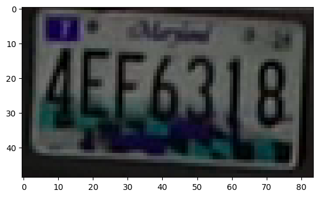
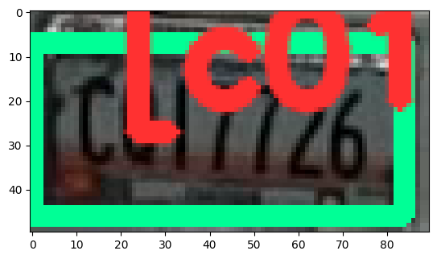

# Car Plate Detection Tutorial

<table align="left">
  <td>
    <a target="_blank" href="https://colab.research.google.com/georgia-tech-db/eva-application-template/blob/main/car_plate_detection.ipynb"> Run on Google Colab</a>
  </td>
  <td>
    <a target="_blank" href="https://colab.research.google.com/georgia-tech-db/eva-application-template/blob/main/car_plate_detection.ipynb"> View source on GitHub</a>
  </td>
  <td>
    <a target="_blank" href="https://colab.research.google.com/georgia-tech-db/eva-application-template/blob/main/car_plate_detection.ipynb"> Download notebook</a>
  </td>
</table>


```python
pip install -r requirements.txt
```

    Collecting evadb==0.1.3
      Using cached evadb-0.1.3-py3-none-any.whl (423 kB)
    Requirement already satisfied: nbformat in /home/jarulraj3/eva/test_evadb/lib/python3.10/site-packages (from -r requirements.txt (line 6)) (5.7.0)
    Requirement already satisfied: ipykernel in /home/jarulraj3/eva/test_evadb/lib/python3.10/site-packages (from -r requirements.txt (line 7)) (6.17.1)
    Requirement already satisfied: ipywidgets in /home/jarulraj3/eva/test_evadb/lib/python3.10/site-packages (from -r requirements.txt (line 8)) (7.7.2)
    Requirement already satisfied: ipython in /home/jarulraj3/eva/test_evadb/lib/python3.10/site-packages (from evadb==0.1.3->-r requirements.txt (line 3)) (8.6.0)
    Requirement already satisfied: faiss-cpu in /home/jarulraj3/eva/test_evadb/lib/python3.10/site-packages (from evadb==0.1.3->-r requirements.txt (line 3)) (1.7.3)
    Requirement already satisfied: lark>=1.0.0 in /home/jarulraj3/eva/test_evadb/lib/python3.10/site-packages (from evadb==0.1.3->-r requirements.txt (line 3)) (1.1.4)
    Requirement already satisfied: aenum>=2.2.0 in /home/jarulraj3/eva/test_evadb/lib/python3.10/site-packages (from evadb==0.1.3->-r requirements.txt (line 3)) (3.1.11)
    Requirement already satisfied: facenet-pytorch>=2.5.2 in /home/jarulraj3/eva/test_evadb/lib/python3.10/site-packages (from evadb==0.1.3->-r requirements.txt (line 3)) (2.5.2)
    Requirement already satisfied: yolov5 in /home/jarulraj3/eva/test_evadb/lib/python3.10/site-packages (from evadb==0.1.3->-r requirements.txt (line 3)) (7.0.6)
    Requirement already satisfied: Pillow>=8.4.0 in /home/jarulraj3/eva/test_evadb/lib/python3.10/site-packages (from evadb==0.1.3->-r requirements.txt (line 3)) (9.0.1)
    Requirement already satisfied: torch>=1.10.0 in /home/jarulraj3/eva/test_evadb/lib/python3.10/site-packages (from evadb==0.1.3->-r requirements.txt (line 3)) (1.13.0)
    Requirement already satisfied: numpy<=1.23.5,>=1.19.5 in /home/jarulraj3/eva/test_evadb/lib/python3.10/site-packages (from evadb==0.1.3->-r requirements.txt (line 3)) (1.23.4)
    Requirement already satisfied: pyyaml>=5.1 in /home/jarulraj3/eva/test_evadb/lib/python3.10/site-packages (from evadb==0.1.3->-r requirements.txt (line 3)) (6.0)
    Requirement already satisfied: pandas>=1.1.5 in /home/jarulraj3/eva/test_evadb/lib/python3.10/site-packages (from evadb==0.1.3->-r requirements.txt (line 3)) (1.5.1)
    Requirement already satisfied: sqlalchemy>=1.4.0 in /home/jarulraj3/eva/test_evadb/lib/python3.10/site-packages (from evadb==0.1.3->-r requirements.txt (line 3)) (1.4.45)
    Requirement already satisfied: sqlalchemy-utils>=0.36.6 in /home/jarulraj3/eva/test_evadb/lib/python3.10/site-packages (from evadb==0.1.3->-r requirements.txt (line 3)) (0.38.3)
    Requirement already satisfied: torchvision>=0.11.1 in /home/jarulraj3/eva/test_evadb/lib/python3.10/site-packages (from evadb==0.1.3->-r requirements.txt (line 3)) (0.14.0)
    Requirement already satisfied: ray>=1.13.0 in /home/jarulraj3/eva/test_evadb/lib/python3.10/site-packages (from evadb==0.1.3->-r requirements.txt (line 3)) (2.1.0)
    Requirement already satisfied: opencv-python<4.6.0.66,>=4.5.4.60 in /home/jarulraj3/eva/test_evadb/lib/python3.10/site-packages (from evadb==0.1.3->-r requirements.txt (line 3)) (4.5.5.64)
    Requirement already satisfied: importlib-metadata<5.0 in /home/jarulraj3/eva/test_evadb/lib/python3.10/site-packages (from evadb==0.1.3->-r requirements.txt (line 3)) (4.13.0)
    Requirement already satisfied: easyocr>=1.5.0 in /home/jarulraj3/eva/test_evadb/lib/python3.10/site-packages (from evadb==0.1.3->-r requirements.txt (line 3)) (1.6.2)
    Requirement already satisfied: traitlets>=5.1 in /home/jarulraj3/eva/test_evadb/lib/python3.10/site-packages (from nbformat->-r requirements.txt (line 6)) (5.5.0)
    Requirement already satisfied: fastjsonschema in /home/jarulraj3/eva/test_evadb/lib/python3.10/site-packages (from nbformat->-r requirements.txt (line 6)) (2.16.2)
    Requirement already satisfied: jsonschema>=2.6 in /home/jarulraj3/eva/test_evadb/lib/python3.10/site-packages (from nbformat->-r requirements.txt (line 6)) (4.17.0)
    Requirement already satisfied: jupyter-core in /home/jarulraj3/eva/test_evadb/lib/python3.10/site-packages (from nbformat->-r requirements.txt (line 6)) (5.0.0)
    Requirement already satisfied: jupyter-client>=6.1.12 in /home/jarulraj3/eva/test_evadb/lib/python3.10/site-packages (from ipykernel->-r requirements.txt (line 7)) (7.4.5)
    Requirement already satisfied: debugpy>=1.0 in /home/jarulraj3/eva/test_evadb/lib/python3.10/site-packages (from ipykernel->-r requirements.txt (line 7)) (1.6.3)
    Requirement already satisfied: tornado>=6.1 in /home/jarulraj3/eva/test_evadb/lib/python3.10/site-packages (from ipykernel->-r requirements.txt (line 7)) (6.2)
    Requirement already satisfied: matplotlib-inline>=0.1 in /home/jarulraj3/eva/test_evadb/lib/python3.10/site-packages (from ipykernel->-r requirements.txt (line 7)) (0.1.6)
    Requirement already satisfied: packaging in /home/jarulraj3/eva/test_evadb/lib/python3.10/site-packages (from ipykernel->-r requirements.txt (line 7)) (21.3)
    Requirement already satisfied: nest-asyncio in /home/jarulraj3/eva/test_evadb/lib/python3.10/site-packages (from ipykernel->-r requirements.txt (line 7)) (1.5.6)
    Requirement already satisfied: pyzmq>=17 in /home/jarulraj3/eva/test_evadb/lib/python3.10/site-packages (from ipykernel->-r requirements.txt (line 7)) (24.0.1)
    Requirement already satisfied: psutil in /home/jarulraj3/eva/test_evadb/lib/python3.10/site-packages (from ipykernel->-r requirements.txt (line 7)) (5.9.4)
    Requirement already satisfied: ipython-genutils~=0.2.0 in /home/jarulraj3/eva/test_evadb/lib/python3.10/site-packages (from ipywidgets->-r requirements.txt (line 8)) (0.2.0)
    Requirement already satisfied: widgetsnbextension~=3.6.0 in /home/jarulraj3/eva/test_evadb/lib/python3.10/site-packages (from ipywidgets->-r requirements.txt (line 8)) (3.6.1)
    Requirement already satisfied: jupyterlab-widgets<3,>=1.0.0 in /home/jarulraj3/eva/test_evadb/lib/python3.10/site-packages (from ipywidgets->-r requirements.txt (line 8)) (1.1.1)
    Requirement already satisfied: scikit-image in /home/jarulraj3/eva/test_evadb/lib/python3.10/site-packages (from easyocr>=1.5.0->evadb==0.1.3->-r requirements.txt (line 3)) (0.19.3)
    Requirement already satisfied: Shapely in /home/jarulraj3/eva/test_evadb/lib/python3.10/site-packages (from easyocr>=1.5.0->evadb==0.1.3->-r requirements.txt (line 3)) (1.8.5.post1)
    Requirement already satisfied: opencv-python-headless<=4.5.4.60 in /home/jarulraj3/eva/test_evadb/lib/python3.10/site-packages (from easyocr>=1.5.0->evadb==0.1.3->-r requirements.txt (line 3)) (4.5.4.60)
    Requirement already satisfied: scipy in /home/jarulraj3/eva/test_evadb/lib/python3.10/site-packages (from easyocr>=1.5.0->evadb==0.1.3->-r requirements.txt (line 3)) (1.9.3)
    Requirement already satisfied: ninja in /home/jarulraj3/eva/test_evadb/lib/python3.10/site-packages (from easyocr>=1.5.0->evadb==0.1.3->-r requirements.txt (line 3)) (1.11.1)
    Requirement already satisfied: python-bidi in /home/jarulraj3/eva/test_evadb/lib/python3.10/site-packages (from easyocr>=1.5.0->evadb==0.1.3->-r requirements.txt (line 3)) (0.4.2)
    Requirement already satisfied: pyclipper in /home/jarulraj3/eva/test_evadb/lib/python3.10/site-packages (from easyocr>=1.5.0->evadb==0.1.3->-r requirements.txt (line 3)) (1.3.0.post3)
    Requirement already satisfied: requests in /home/jarulraj3/eva/test_evadb/lib/python3.10/site-packages (from facenet-pytorch>=2.5.2->evadb==0.1.3->-r requirements.txt (line 3)) (2.28.1)
    Requirement already satisfied: zipp>=0.5 in /home/jarulraj3/eva/test_evadb/lib/python3.10/site-packages (from importlib-metadata<5.0->evadb==0.1.3->-r requirements.txt (line 3)) (3.10.0)
    Requirement already satisfied: stack-data in /home/jarulraj3/eva/test_evadb/lib/python3.10/site-packages (from ipython->evadb==0.1.3->-r requirements.txt (line 3)) (0.6.0)
    Requirement already satisfied: prompt-toolkit<3.1.0,>3.0.1 in /home/jarulraj3/eva/test_evadb/lib/python3.10/site-packages (from ipython->evadb==0.1.3->-r requirements.txt (line 3)) (3.0.32)
    Requirement already satisfied: pexpect>4.3 in /home/jarulraj3/eva/test_evadb/lib/python3.10/site-packages (from ipython->evadb==0.1.3->-r requirements.txt (line 3)) (4.8.0)
    Requirement already satisfied: jedi>=0.16 in /home/jarulraj3/eva/test_evadb/lib/python3.10/site-packages (from ipython->evadb==0.1.3->-r requirements.txt (line 3)) (0.18.1)
    Requirement already satisfied: pickleshare in /home/jarulraj3/eva/test_evadb/lib/python3.10/site-packages (from ipython->evadb==0.1.3->-r requirements.txt (line 3)) (0.7.5)
    Requirement already satisfied: pygments>=2.4.0 in /home/jarulraj3/eva/test_evadb/lib/python3.10/site-packages (from ipython->evadb==0.1.3->-r requirements.txt (line 3)) (2.13.0)
    Requirement already satisfied: decorator in /home/jarulraj3/eva/test_evadb/lib/python3.10/site-packages (from ipython->evadb==0.1.3->-r requirements.txt (line 3)) (5.1.1)
    Requirement already satisfied: backcall in /home/jarulraj3/eva/test_evadb/lib/python3.10/site-packages (from ipython->evadb==0.1.3->-r requirements.txt (line 3)) (0.2.0)
    Requirement already satisfied: attrs>=17.4.0 in /home/jarulraj3/eva/test_evadb/lib/python3.10/site-packages (from jsonschema>=2.6->nbformat->-r requirements.txt (line 6)) (21.4.0)
    Requirement already satisfied: pyrsistent!=0.17.0,!=0.17.1,!=0.17.2,>=0.14.0 in /home/jarulraj3/eva/test_evadb/lib/python3.10/site-packages (from jsonschema>=2.6->nbformat->-r requirements.txt (line 6)) (0.19.2)
    Requirement already satisfied: python-dateutil>=2.8.2 in /home/jarulraj3/eva/test_evadb/lib/python3.10/site-packages (from jupyter-client>=6.1.12->ipykernel->-r requirements.txt (line 7)) (2.8.2)
    Requirement already satisfied: entrypoints in /home/jarulraj3/eva/test_evadb/lib/python3.10/site-packages (from jupyter-client>=6.1.12->ipykernel->-r requirements.txt (line 7)) (0.4)
    Requirement already satisfied: platformdirs in /home/jarulraj3/eva/test_evadb/lib/python3.10/site-packages (from jupyter-core->nbformat->-r requirements.txt (line 6)) (2.5.3)
    Requirement already satisfied: pytz>=2020.1 in /home/jarulraj3/eva/test_evadb/lib/python3.10/site-packages (from pandas>=1.1.5->evadb==0.1.3->-r requirements.txt (line 3)) (2022.6)
    Requirement already satisfied: msgpack<2.0.0,>=1.0.0 in /home/jarulraj3/eva/test_evadb/lib/python3.10/site-packages (from ray>=1.13.0->evadb==0.1.3->-r requirements.txt (line 3)) (1.0.4)
    Requirement already satisfied: frozenlist in /home/jarulraj3/eva/test_evadb/lib/python3.10/site-packages (from ray>=1.13.0->evadb==0.1.3->-r requirements.txt (line 3)) (1.3.3)
    Requirement already satisfied: protobuf!=3.19.5,>=3.15.3 in /home/jarulraj3/eva/test_evadb/lib/python3.10/site-packages (from ray>=1.13.0->evadb==0.1.3->-r requirements.txt (line 3)) (3.20.3)
    Requirement already satisfied: grpcio>=1.42.0 in /home/jarulraj3/eva/test_evadb/lib/python3.10/site-packages (from ray>=1.13.0->evadb==0.1.3->-r requirements.txt (line 3)) (1.50.0)
    Requirement already satisfied: virtualenv>=20.0.24 in /home/jarulraj3/eva/test_evadb/lib/python3.10/site-packages (from ray>=1.13.0->evadb==0.1.3->-r requirements.txt (line 3)) (20.16.6)
    Requirement already satisfied: filelock in /home/jarulraj3/eva/test_evadb/lib/python3.10/site-packages (from ray>=1.13.0->evadb==0.1.3->-r requirements.txt (line 3)) (3.8.0)
    Requirement already satisfied: aiosignal in /home/jarulraj3/eva/test_evadb/lib/python3.10/site-packages (from ray>=1.13.0->evadb==0.1.3->-r requirements.txt (line 3)) (1.3.1)
    Requirement already satisfied: click<=8.0.4,>=7.0 in /home/jarulraj3/eva/test_evadb/lib/python3.10/site-packages (from ray>=1.13.0->evadb==0.1.3->-r requirements.txt (line 3)) (8.0.4)
    Requirement already satisfied: greenlet!=0.4.17 in /home/jarulraj3/eva/test_evadb/lib/python3.10/site-packages (from sqlalchemy>=1.4.0->evadb==0.1.3->-r requirements.txt (line 3)) (2.0.1)
    Requirement already satisfied: nvidia-cudnn-cu11==8.5.0.96 in /home/jarulraj3/eva/test_evadb/lib/python3.10/site-packages (from torch>=1.10.0->evadb==0.1.3->-r requirements.txt (line 3)) (8.5.0.96)
    Requirement already satisfied: typing-extensions in /home/jarulraj3/eva/test_evadb/lib/python3.10/site-packages (from torch>=1.10.0->evadb==0.1.3->-r requirements.txt (line 3)) (4.4.0)
    Requirement already satisfied: nvidia-cuda-runtime-cu11==11.7.99 in /home/jarulraj3/eva/test_evadb/lib/python3.10/site-packages (from torch>=1.10.0->evadb==0.1.3->-r requirements.txt (line 3)) (11.7.99)
    Requirement already satisfied: nvidia-cublas-cu11==11.10.3.66 in /home/jarulraj3/eva/test_evadb/lib/python3.10/site-packages (from torch>=1.10.0->evadb==0.1.3->-r requirements.txt (line 3)) (11.10.3.66)
    Requirement already satisfied: nvidia-cuda-nvrtc-cu11==11.7.99 in /home/jarulraj3/eva/test_evadb/lib/python3.10/site-packages (from torch>=1.10.0->evadb==0.1.3->-r requirements.txt (line 3)) (11.7.99)
    Requirement already satisfied: wheel in /home/jarulraj3/eva/test_evadb/lib/python3.10/site-packages (from nvidia-cublas-cu11==11.10.3.66->torch>=1.10.0->evadb==0.1.3->-r requirements.txt (line 3)) (0.38.4)
    Requirement already satisfied: setuptools in /home/jarulraj3/eva/test_evadb/lib/python3.10/site-packages (from nvidia-cublas-cu11==11.10.3.66->torch>=1.10.0->evadb==0.1.3->-r requirements.txt (line 3)) (65.6.0)
    Requirement already satisfied: notebook>=4.4.1 in /home/jarulraj3/eva/test_evadb/lib/python3.10/site-packages (from widgetsnbextension~=3.6.0->ipywidgets->-r requirements.txt (line 8)) (6.5.2)
    Requirement already satisfied: pyparsing!=3.0.5,>=2.0.2 in /home/jarulraj3/eva/test_evadb/lib/python3.10/site-packages (from packaging->ipykernel->-r requirements.txt (line 7)) (3.0.9)
    Requirement already satisfied: tqdm>=4.64.0 in /home/jarulraj3/eva/test_evadb/lib/python3.10/site-packages (from yolov5->evadb==0.1.3->-r requirements.txt (line 3)) (4.64.1)
    Requirement already satisfied: seaborn>=0.11.0 in /home/jarulraj3/eva/test_evadb/lib/python3.10/site-packages (from yolov5->evadb==0.1.3->-r requirements.txt (line 3)) (0.12.1)
    Requirement already satisfied: gitpython in /home/jarulraj3/eva/test_evadb/lib/python3.10/site-packages (from yolov5->evadb==0.1.3->-r requirements.txt (line 3)) (3.1.29)
    Requirement already satisfied: matplotlib>=3.2.2 in /home/jarulraj3/eva/test_evadb/lib/python3.10/site-packages (from yolov5->evadb==0.1.3->-r requirements.txt (line 3)) (3.6.2)
    Requirement already satisfied: boto3>=1.19.1 in /home/jarulraj3/eva/test_evadb/lib/python3.10/site-packages (from yolov5->evadb==0.1.3->-r requirements.txt (line 3)) (1.26.41)
    Requirement already satisfied: thop>=0.1.1 in /home/jarulraj3/eva/test_evadb/lib/python3.10/site-packages (from yolov5->evadb==0.1.3->-r requirements.txt (line 3)) (0.1.1.post2209072238)
    Requirement already satisfied: fire in /home/jarulraj3/eva/test_evadb/lib/python3.10/site-packages (from yolov5->evadb==0.1.3->-r requirements.txt (line 3)) (0.5.0)
    Requirement already satisfied: huggingface-hub>=0.11.1 in /home/jarulraj3/eva/test_evadb/lib/python3.10/site-packages (from yolov5->evadb==0.1.3->-r requirements.txt (line 3)) (0.11.1)
    Requirement already satisfied: sahi>=0.11.9 in /home/jarulraj3/eva/test_evadb/lib/python3.10/site-packages (from yolov5->evadb==0.1.3->-r requirements.txt (line 3)) (0.11.9)
    Requirement already satisfied: tensorboard>=2.4.1 in /home/jarulraj3/eva/test_evadb/lib/python3.10/site-packages (from yolov5->evadb==0.1.3->-r requirements.txt (line 3)) (2.11.0)
    Requirement already satisfied: jmespath<2.0.0,>=0.7.1 in /home/jarulraj3/eva/test_evadb/lib/python3.10/site-packages (from boto3>=1.19.1->yolov5->evadb==0.1.3->-r requirements.txt (line 3)) (1.0.1)
    Requirement already satisfied: botocore<1.30.0,>=1.29.41 in /home/jarulraj3/eva/test_evadb/lib/python3.10/site-packages (from boto3>=1.19.1->yolov5->evadb==0.1.3->-r requirements.txt (line 3)) (1.29.41)
    Requirement already satisfied: s3transfer<0.7.0,>=0.6.0 in /home/jarulraj3/eva/test_evadb/lib/python3.10/site-packages (from boto3>=1.19.1->yolov5->evadb==0.1.3->-r requirements.txt (line 3)) (0.6.0)
    Requirement already satisfied: six>=1.5.2 in /home/jarulraj3/eva/test_evadb/lib/python3.10/site-packages (from grpcio>=1.42.0->ray>=1.13.0->evadb==0.1.3->-r requirements.txt (line 3)) (1.16.0)
    Requirement already satisfied: parso<0.9.0,>=0.8.0 in /home/jarulraj3/eva/test_evadb/lib/python3.10/site-packages (from jedi>=0.16->ipython->evadb==0.1.3->-r requirements.txt (line 3)) (0.8.3)
    Requirement already satisfied: cycler>=0.10 in /home/jarulraj3/eva/test_evadb/lib/python3.10/site-packages (from matplotlib>=3.2.2->yolov5->evadb==0.1.3->-r requirements.txt (line 3)) (0.11.0)
    Requirement already satisfied: contourpy>=1.0.1 in /home/jarulraj3/eva/test_evadb/lib/python3.10/site-packages (from matplotlib>=3.2.2->yolov5->evadb==0.1.3->-r requirements.txt (line 3)) (1.0.6)
    Requirement already satisfied: kiwisolver>=1.0.1 in /home/jarulraj3/eva/test_evadb/lib/python3.10/site-packages (from matplotlib>=3.2.2->yolov5->evadb==0.1.3->-r requirements.txt (line 3)) (1.4.4)
    Requirement already satisfied: fonttools>=4.22.0 in /home/jarulraj3/eva/test_evadb/lib/python3.10/site-packages (from matplotlib>=3.2.2->yolov5->evadb==0.1.3->-r requirements.txt (line 3)) (4.38.0)
    Requirement already satisfied: Send2Trash>=1.8.0 in /home/jarulraj3/eva/test_evadb/lib/python3.10/site-packages (from notebook>=4.4.1->widgetsnbextension~=3.6.0->ipywidgets->-r requirements.txt (line 8)) (1.8.0)
    Requirement already satisfied: jinja2 in /home/jarulraj3/eva/test_evadb/lib/python3.10/site-packages (from notebook>=4.4.1->widgetsnbextension~=3.6.0->ipywidgets->-r requirements.txt (line 8)) (3.1.2)
    Requirement already satisfied: nbconvert>=5 in /home/jarulraj3/eva/test_evadb/lib/python3.10/site-packages (from notebook>=4.4.1->widgetsnbextension~=3.6.0->ipywidgets->-r requirements.txt (line 8)) (6.5.4)
    Requirement already satisfied: prometheus-client in /home/jarulraj3/eva/test_evadb/lib/python3.10/site-packages (from notebook>=4.4.1->widgetsnbextension~=3.6.0->ipywidgets->-r requirements.txt (line 8)) (0.15.0)
    Requirement already satisfied: argon2-cffi in /home/jarulraj3/eva/test_evadb/lib/python3.10/site-packages (from notebook>=4.4.1->widgetsnbextension~=3.6.0->ipywidgets->-r requirements.txt (line 8)) (21.3.0)
    Requirement already satisfied: nbclassic>=0.4.7 in /home/jarulraj3/eva/test_evadb/lib/python3.10/site-packages (from notebook>=4.4.1->widgetsnbextension~=3.6.0->ipywidgets->-r requirements.txt (line 8)) (0.4.8)
    Requirement already satisfied: terminado>=0.8.3 in /home/jarulraj3/eva/test_evadb/lib/python3.10/site-packages (from notebook>=4.4.1->widgetsnbextension~=3.6.0->ipywidgets->-r requirements.txt (line 8)) (0.17.0)
    Requirement already satisfied: ptyprocess>=0.5 in /home/jarulraj3/eva/test_evadb/lib/python3.10/site-packages (from pexpect>4.3->ipython->evadb==0.1.3->-r requirements.txt (line 3)) (0.7.0)
    Requirement already satisfied: wcwidth in /home/jarulraj3/eva/test_evadb/lib/python3.10/site-packages (from prompt-toolkit<3.1.0,>3.0.1->ipython->evadb==0.1.3->-r requirements.txt (line 3)) (0.2.5)
    Requirement already satisfied: certifi>=2017.4.17 in /home/jarulraj3/eva/test_evadb/lib/python3.10/site-packages (from requests->facenet-pytorch>=2.5.2->evadb==0.1.3->-r requirements.txt (line 3)) (2022.9.24)
    Requirement already satisfied: urllib3<1.27,>=1.21.1 in /home/jarulraj3/eva/test_evadb/lib/python3.10/site-packages (from requests->facenet-pytorch>=2.5.2->evadb==0.1.3->-r requirements.txt (line 3)) (1.26.12)
    Requirement already satisfied: charset-normalizer<3,>=2 in /home/jarulraj3/eva/test_evadb/lib/python3.10/site-packages (from requests->facenet-pytorch>=2.5.2->evadb==0.1.3->-r requirements.txt (line 3)) (2.1.1)
    Requirement already satisfied: idna<4,>=2.5 in /home/jarulraj3/eva/test_evadb/lib/python3.10/site-packages (from requests->facenet-pytorch>=2.5.2->evadb==0.1.3->-r requirements.txt (line 3)) (3.4)
    Requirement already satisfied: terminaltables in /home/jarulraj3/eva/test_evadb/lib/python3.10/site-packages (from sahi>=0.11.9->yolov5->evadb==0.1.3->-r requirements.txt (line 3)) (3.1.10)
    Requirement already satisfied: pybboxes==0.1.5 in /home/jarulraj3/eva/test_evadb/lib/python3.10/site-packages (from sahi>=0.11.9->yolov5->evadb==0.1.3->-r requirements.txt (line 3)) (0.1.5)
    Requirement already satisfied: tensorboard-data-server<0.7.0,>=0.6.0 in /home/jarulraj3/eva/test_evadb/lib/python3.10/site-packages (from tensorboard>=2.4.1->yolov5->evadb==0.1.3->-r requirements.txt (line 3)) (0.6.1)
    Requirement already satisfied: tensorboard-plugin-wit>=1.6.0 in /home/jarulraj3/eva/test_evadb/lib/python3.10/site-packages (from tensorboard>=2.4.1->yolov5->evadb==0.1.3->-r requirements.txt (line 3)) (1.8.1)
    Requirement already satisfied: werkzeug>=1.0.1 in /home/jarulraj3/eva/test_evadb/lib/python3.10/site-packages (from tensorboard>=2.4.1->yolov5->evadb==0.1.3->-r requirements.txt (line 3)) (2.2.2)
    Requirement already satisfied: absl-py>=0.4 in /home/jarulraj3/eva/test_evadb/lib/python3.10/site-packages (from tensorboard>=2.4.1->yolov5->evadb==0.1.3->-r requirements.txt (line 3)) (1.3.0)
    Requirement already satisfied: google-auth-oauthlib<0.5,>=0.4.1 in /home/jarulraj3/eva/test_evadb/lib/python3.10/site-packages (from tensorboard>=2.4.1->yolov5->evadb==0.1.3->-r requirements.txt (line 3)) (0.4.6)
    Requirement already satisfied: markdown>=2.6.8 in /home/jarulraj3/eva/test_evadb/lib/python3.10/site-packages (from tensorboard>=2.4.1->yolov5->evadb==0.1.3->-r requirements.txt (line 3)) (3.4.1)
    Requirement already satisfied: google-auth<3,>=1.6.3 in /home/jarulraj3/eva/test_evadb/lib/python3.10/site-packages (from tensorboard>=2.4.1->yolov5->evadb==0.1.3->-r requirements.txt (line 3)) (2.15.0)
    Requirement already satisfied: distlib<1,>=0.3.6 in /home/jarulraj3/eva/test_evadb/lib/python3.10/site-packages (from virtualenv>=20.0.24->ray>=1.13.0->evadb==0.1.3->-r requirements.txt (line 3)) (0.3.6)
    Requirement already satisfied: termcolor in /home/jarulraj3/eva/test_evadb/lib/python3.10/site-packages (from fire->yolov5->evadb==0.1.3->-r requirements.txt (line 3)) (2.1.0)
    Requirement already satisfied: gitdb<5,>=4.0.1 in /home/jarulraj3/eva/test_evadb/lib/python3.10/site-packages (from gitpython->yolov5->evadb==0.1.3->-r requirements.txt (line 3)) (4.0.9)
    Requirement already satisfied: networkx>=2.2 in /home/jarulraj3/eva/test_evadb/lib/python3.10/site-packages (from scikit-image->easyocr>=1.5.0->evadb==0.1.3->-r requirements.txt (line 3)) (2.8.8)
    Requirement already satisfied: tifffile>=2019.7.26 in /home/jarulraj3/eva/test_evadb/lib/python3.10/site-packages (from scikit-image->easyocr>=1.5.0->evadb==0.1.3->-r requirements.txt (line 3)) (2022.10.10)
    Requirement already satisfied: imageio>=2.4.1 in /home/jarulraj3/eva/test_evadb/lib/python3.10/site-packages (from scikit-image->easyocr>=1.5.0->evadb==0.1.3->-r requirements.txt (line 3)) (2.22.4)
    Requirement already satisfied: PyWavelets>=1.1.1 in /home/jarulraj3/eva/test_evadb/lib/python3.10/site-packages (from scikit-image->easyocr>=1.5.0->evadb==0.1.3->-r requirements.txt (line 3)) (1.4.1)
    Requirement already satisfied: asttokens>=2.1.0 in /home/jarulraj3/eva/test_evadb/lib/python3.10/site-packages (from stack-data->ipython->evadb==0.1.3->-r requirements.txt (line 3)) (2.1.0)
    Requirement already satisfied: pure-eval in /home/jarulraj3/eva/test_evadb/lib/python3.10/site-packages (from stack-data->ipython->evadb==0.1.3->-r requirements.txt (line 3)) (0.2.2)
    Requirement already satisfied: executing>=1.2.0 in /home/jarulraj3/eva/test_evadb/lib/python3.10/site-packages (from stack-data->ipython->evadb==0.1.3->-r requirements.txt (line 3)) (1.2.0)
    Requirement already satisfied: smmap<6,>=3.0.1 in /home/jarulraj3/eva/test_evadb/lib/python3.10/site-packages (from gitdb<5,>=4.0.1->gitpython->yolov5->evadb==0.1.3->-r requirements.txt (line 3)) (5.0.0)
    Requirement already satisfied: cachetools<6.0,>=2.0.0 in /home/jarulraj3/eva/test_evadb/lib/python3.10/site-packages (from google-auth<3,>=1.6.3->tensorboard>=2.4.1->yolov5->evadb==0.1.3->-r requirements.txt (line 3)) (5.2.0)
    Requirement already satisfied: rsa<5,>=3.1.4 in /home/jarulraj3/eva/test_evadb/lib/python3.10/site-packages (from google-auth<3,>=1.6.3->tensorboard>=2.4.1->yolov5->evadb==0.1.3->-r requirements.txt (line 3)) (4.9)
    Requirement already satisfied: pyasn1-modules>=0.2.1 in /home/jarulraj3/eva/test_evadb/lib/python3.10/site-packages (from google-auth<3,>=1.6.3->tensorboard>=2.4.1->yolov5->evadb==0.1.3->-r requirements.txt (line 3)) (0.2.8)
    Requirement already satisfied: requests-oauthlib>=0.7.0 in /home/jarulraj3/eva/test_evadb/lib/python3.10/site-packages (from google-auth-oauthlib<0.5,>=0.4.1->tensorboard>=2.4.1->yolov5->evadb==0.1.3->-r requirements.txt (line 3)) (1.3.1)
    Requirement already satisfied: jupyter-server>=1.8 in /home/jarulraj3/eva/test_evadb/lib/python3.10/site-packages (from nbclassic>=0.4.7->notebook>=4.4.1->widgetsnbextension~=3.6.0->ipywidgets->-r requirements.txt (line 8)) (1.23.2)
    Requirement already satisfied: notebook-shim>=0.1.0 in /home/jarulraj3/eva/test_evadb/lib/python3.10/site-packages (from nbclassic>=0.4.7->notebook>=4.4.1->widgetsnbextension~=3.6.0->ipywidgets->-r requirements.txt (line 8)) (0.2.2)
    Requirement already satisfied: bleach in /home/jarulraj3/eva/test_evadb/lib/python3.10/site-packages (from nbconvert>=5->notebook>=4.4.1->widgetsnbextension~=3.6.0->ipywidgets->-r requirements.txt (line 8)) (5.0.1)
    Requirement already satisfied: jupyterlab-pygments in /home/jarulraj3/eva/test_evadb/lib/python3.10/site-packages (from nbconvert>=5->notebook>=4.4.1->widgetsnbextension~=3.6.0->ipywidgets->-r requirements.txt (line 8)) (0.2.2)
    Requirement already satisfied: nbclient>=0.5.0 in /home/jarulraj3/eva/test_evadb/lib/python3.10/site-packages (from nbconvert>=5->notebook>=4.4.1->widgetsnbextension~=3.6.0->ipywidgets->-r requirements.txt (line 8)) (0.6.8)
    Requirement already satisfied: pandocfilters>=1.4.1 in /home/jarulraj3/eva/test_evadb/lib/python3.10/site-packages (from nbconvert>=5->notebook>=4.4.1->widgetsnbextension~=3.6.0->ipywidgets->-r requirements.txt (line 8)) (1.5.0)
    Requirement already satisfied: lxml in /home/jarulraj3/eva/test_evadb/lib/python3.10/site-packages (from nbconvert>=5->notebook>=4.4.1->widgetsnbextension~=3.6.0->ipywidgets->-r requirements.txt (line 8)) (4.9.1)
    Requirement already satisfied: mistune<2,>=0.8.1 in /home/jarulraj3/eva/test_evadb/lib/python3.10/site-packages (from nbconvert>=5->notebook>=4.4.1->widgetsnbextension~=3.6.0->ipywidgets->-r requirements.txt (line 8)) (0.8.4)
    Requirement already satisfied: beautifulsoup4 in /home/jarulraj3/eva/test_evadb/lib/python3.10/site-packages (from nbconvert>=5->notebook>=4.4.1->widgetsnbextension~=3.6.0->ipywidgets->-r requirements.txt (line 8)) (4.11.1)
    Requirement already satisfied: MarkupSafe>=2.0 in /home/jarulraj3/eva/test_evadb/lib/python3.10/site-packages (from nbconvert>=5->notebook>=4.4.1->widgetsnbextension~=3.6.0->ipywidgets->-r requirements.txt (line 8)) (2.1.1)
    Requirement already satisfied: defusedxml in /home/jarulraj3/eva/test_evadb/lib/python3.10/site-packages (from nbconvert>=5->notebook>=4.4.1->widgetsnbextension~=3.6.0->ipywidgets->-r requirements.txt (line 8)) (0.7.1)
    Requirement already satisfied: tinycss2 in /home/jarulraj3/eva/test_evadb/lib/python3.10/site-packages (from nbconvert>=5->notebook>=4.4.1->widgetsnbextension~=3.6.0->ipywidgets->-r requirements.txt (line 8)) (1.2.1)
    Requirement already satisfied: argon2-cffi-bindings in /home/jarulraj3/eva/test_evadb/lib/python3.10/site-packages (from argon2-cffi->notebook>=4.4.1->widgetsnbextension~=3.6.0->ipywidgets->-r requirements.txt (line 8)) (21.2.0)
    Requirement already satisfied: websocket-client in /home/jarulraj3/eva/test_evadb/lib/python3.10/site-packages (from jupyter-server>=1.8->nbclassic>=0.4.7->notebook>=4.4.1->widgetsnbextension~=3.6.0->ipywidgets->-r requirements.txt (line 8)) (1.4.2)
    Requirement already satisfied: anyio<4,>=3.1.0 in /home/jarulraj3/eva/test_evadb/lib/python3.10/site-packages (from jupyter-server>=1.8->nbclassic>=0.4.7->notebook>=4.4.1->widgetsnbextension~=3.6.0->ipywidgets->-r requirements.txt (line 8)) (3.6.2)
    Requirement already satisfied: pyasn1<0.5.0,>=0.4.6 in /home/jarulraj3/eva/test_evadb/lib/python3.10/site-packages (from pyasn1-modules>=0.2.1->google-auth<3,>=1.6.3->tensorboard>=2.4.1->yolov5->evadb==0.1.3->-r requirements.txt (line 3)) (0.4.8)
    Requirement already satisfied: oauthlib>=3.0.0 in /home/jarulraj3/eva/test_evadb/lib/python3.10/site-packages (from requests-oauthlib>=0.7.0->google-auth-oauthlib<0.5,>=0.4.1->tensorboard>=2.4.1->yolov5->evadb==0.1.3->-r requirements.txt (line 3)) (3.2.2)
    Requirement already satisfied: cffi>=1.0.1 in /home/jarulraj3/eva/test_evadb/lib/python3.10/site-packages (from argon2-cffi-bindings->argon2-cffi->notebook>=4.4.1->widgetsnbextension~=3.6.0->ipywidgets->-r requirements.txt (line 8)) (1.15.1)
    Requirement already satisfied: soupsieve>1.2 in /home/jarulraj3/eva/test_evadb/lib/python3.10/site-packages (from beautifulsoup4->nbconvert>=5->notebook>=4.4.1->widgetsnbextension~=3.6.0->ipywidgets->-r requirements.txt (line 8)) (2.3.2.post1)
    Requirement already satisfied: webencodings in /home/jarulraj3/eva/test_evadb/lib/python3.10/site-packages (from bleach->nbconvert>=5->notebook>=4.4.1->widgetsnbextension~=3.6.0->ipywidgets->-r requirements.txt (line 8)) (0.5.1)
    Requirement already satisfied: sniffio>=1.1 in /home/jarulraj3/eva/test_evadb/lib/python3.10/site-packages (from anyio<4,>=3.1.0->jupyter-server>=1.8->nbclassic>=0.4.7->notebook>=4.4.1->widgetsnbextension~=3.6.0->ipywidgets->-r requirements.txt (line 8)) (1.3.0)
    Requirement already satisfied: pycparser in /home/jarulraj3/eva/test_evadb/lib/python3.10/site-packages (from cffi>=1.0.1->argon2-cffi-bindings->argon2-cffi->notebook>=4.4.1->widgetsnbextension~=3.6.0->ipywidgets->-r requirements.txt (line 8)) (2.21)
    Installing collected packages: evadb
      Attempting uninstall: evadb
        Found existing installation: evadb 0.1.4+dev
        Uninstalling evadb-0.1.4+dev:
          Successfully uninstalled evadb-0.1.4+dev
    Successfully installed evadb-0.1.3
    Note: you may need to restart the kernel to use updated packages.


### Start EVA server

We are reusing the start server notebook for launching the EVA server.


```python
!wget -nc "https://raw.githubusercontent.com/georgia-tech-db/eva/master/tutorials/00-start-eva-server.ipynb"
%run 00-start-eva-server.ipynb
cursor = connect_to_server()
```

    File ‘00-start-eva-server.ipynb’ already there; not retrieving.
    
    nohup eva_server > eva.log 2>&1 &
    
    Note: you may need to restart the kernel to use updated packages.


### Getting the Video Files

### Load the surveillance videos for analysis


```python
cursor.execute('DROP TABLE IF EXISTS MyVideos;')
response = cursor.fetch_all()
print(response)
cursor.execute('LOAD VIDEO "1.mp4" INTO MyVideos;')
response = cursor.fetch_all()
print(response)
```

    @status: ResponseStatus.SUCCESS
    @batch: 
                                           0
    0  Table Successfully dropped: MyVideos
    @query_time: 0.027615061029791832
    @status: ResponseStatus.SUCCESS
    @batch: 
                                0
    0  Number of loaded VIDEO: 1
    @query_time: 0.3272820159327239


### Visualize Video


```python
from ipywidgets import Video
Video.from_file("1.mp4", embed=True)
```


    Video(value=b'\x00\x00\x00\x1cftypmp42\x00\x00\x00\x01isommp41mp42\x00\x00\x00\x01mdat\x00\x00\x00\x00\x00\xf3…


### Create Custom UDF for Car Plate Detection


```python
cursor.execute("DROP UDF IF EXISTS CarPlateDetector;")
response = cursor.fetch_all()
print(response)
cursor.execute("""CREATE UDF IF NOT EXISTS CarPlateDetector
      INPUT  (frame NDARRAY UINT8(3, ANYDIM, ANYDIM))
      OUTPUT (results NDARRAY FLOAT32(ANYDIM, ANYDIM))
      TYPE  Classification
      IMPL  'car_plate_detector.py';
      """) 
response = cursor.fetch_all()
print(response)
```

    @status: ResponseStatus.SUCCESS
    @batch: 
                                                0
    0  UDF CarPlateDetector successfully dropped
    @query_time: 0.01475345203652978
    @status: ResponseStatus.SUCCESS
    @batch: 
                                                               0
    0  UDF CarPlateDetector successfully added to the database.
    @query_time: 1.2318748810794204


### Run Car Plate Detector on Video


```python
cursor.execute("""SELECT id, CarPlateDetector(data)
                  FROM MyVideos 
                  WHERE id < 1""")
response = cursor.fetch_all()
print(response)
```

    @status: ResponseStatus.SUCCESS
    @batch: 
        myvideos.id  \
    0            0   
    
                                                                                  carplatedetector.results  
    0  [[0 0 0 ... 0 0 0], [0 0 0 ... 0 0 0], [0 0 0 ... 0 0 0], [0 0 0 ... 0 0 0], [0 0 0 ... 0 0 0], ...  
    @query_time: 6.116606184048578


### Visualize Model Output on Video


```python
import cv2
import numpy as np
def image_resize(image, width=None, height=None, inter=cv2.INTER_CUBIC):
    # https://stackoverflow.com/questions/44650888/resize-an-image-without-distortion-opencv
    dim = None
    (h, w) = image.shape[:2]

    if width is None and height is None:
        return image

    if width is None:
        r = height / float(h)
        dim = (int(w * r), height)
    else:
        r = width / float(w)
        dim = (width, int(h * r))

    resized = cv2.resize(image, dim, interpolation=inter)

    return resized
```


```python
def unsharp_mask(image, kernel_size=(5, 5), sigma=1.0, amount=1.0, threshold=0):
    # https://stackoverflow.com/questions/4993082/how-to-sharpen-an-image-in-opencv
    blurred = cv2.GaussianBlur(image, kernel_size, sigma)
    sharpened = float(amount + 1) * image - float(amount) * blurred
    sharpened = np.maximum(sharpened, np.zeros(sharpened.shape))
    sharpened = np.minimum(sharpened, 255 * np.ones(sharpened.shape))
    sharpened = sharpened.round().astype(np.uint8)
    if threshold > 0:
        low_contrast_mask = np.absolute(image - blurred) < threshold
        np.copyto(sharpened, image, where=low_contrast_mask)
    return sharpened
```


```python
def show_images(images, cols=1, prefix='Image ', titles=None):
    # https://gist.github.com/soply/f3eec2e79c165e39c9d540e916142ae1
    assert((titles is None)or (len(images) == len(titles)))
    n_images = len(images)
    if titles is None:
        titles = [f'{prefix} ({i})' for i in range(1, n_images + 1)]
    fig = plt.figure()
    for n, (image, title) in enumerate(zip(images, titles)):
        a = fig.add_subplot(cols, int(np.ceil(n_images/float(cols))), n + 1)
        if image.ndim == 2:
            plt.gray()
        plt.imshow(image)
        a.set_title(title)
    fig.set_size_inches(np.array(fig.get_size_inches()) * n_images)
    plt.show()
```


```python
def remove_noise(image):
    gray = cv2.cvtColor(image, cv2.COLOR_BGR2GRAY)
    thresh = cv2.threshold(gray, 0, 255, cv2.THRESH_BINARY_INV + cv2.THRESH_OTSU)[1]

    # Morph open to remove noise
    kernel = cv2.getStructuringElement(cv2.MORPH_RECT, (2,2))
    opening = cv2.morphologyEx(thresh, cv2.MORPH_OPEN, kernel, iterations=1)

    # Find contours and remove small noise
    cnts = cv2.findContours(opening, cv2.RETR_EXTERNAL, cv2.CHAIN_APPROX_SIMPLE)
    cnts = cnts[0] if len(cnts) == 2 else cnts[1]
    for c in cnts:
        area = cv2.contourArea(c)
        if area < 200:
            cv2.drawContours(opening, [c], -1, 0, -1)

    # Invert and apply slight Gaussian blur
    result = 255 - opening
    #result = cv2.GaussianBlur(result, (3,3), 0)
    return result
```


```python
from pprint import pprint
from matplotlib import pyplot as plt

def annotate_video(detections, input_video_path):
    color1=(207, 248, 64)
    color2=(255, 49, 49)
    thickness=4

    vcap = cv2.VideoCapture(input_video_path)
    width = int(vcap.get(3))
    height = int(vcap.get(4))


    frame_id = 0
    # Capture frame-by-frame
    # ret = 1 if the video is captured; frame is the image
    ret, frame = vcap.read()
    car_plates = []

    while ret:
        df = detections
        df = df[['carplatedetector.results']][df.index == frame_id]
        if df.size:
            dfList = df.values.tolist()
            mask = np.array(dfList[0][0])
            mask = mask.astype(np.uint8)
            #plt.imshow(mask)
            #frame = cv2.cvtColor(np.array(frame, copy=True), cv2.COLOR_RGB2BGR)
            contours, hierarchy = cv2.findContours(
                mask, cv2.RETR_TREE, cv2.CHAIN_APPROX_SIMPLE)
            plates = []

            for j, c in enumerate(contours):
                x,y,w,h = cv2.boundingRect(c)
                plate = frame[y:y+h, x:x+w]
                fourcc = cv2.VideoWriter_fourcc('m', 'p', '4', 'v')
                fps = 25
                dim = plate.shape[:2]
                video = cv2.VideoWriter("frame" + str(frame_id)+ "_plate" + str(j) + ".mp4", fourcc, fps, (dim[1], dim[0]))
                for _ in range(50): video.write(plate)
                video.release()
                plates.append(plate)
                if frame_id % 5 == 0:
                    plt.imshow(plate)
                    plt.show()
            # show_images(plates,  prefix='License plate')
            car_plates.append(plates)
        frame_id+=1
        ret, frame = vcap.read()
    return car_plates
```


```python
from ipywidgets import Video, Image
input_path = "1.mp4"
dataframe = response.batch.frames
car_plates = annotate_video(dataframe, input_path)
```


    

    


    

    


    

    


    

    


```python
from PIL import Image
def plates2videos(car_plates):
    for i, plates in enumerate(car_plates):
        for j, plate in enumerate(plates):
            fourcc = cv2.VideoWriter_fourcc('m', 'p', '4', 'v')
            fps = 25
            dim = plate.shape[:2]
            video = cv2.VideoWriter("frame" + str(i)+ "_plate" + str(j) + ".mp4", fourcc, fps, (dim[1], dim[0]))
            plate = cv2.cvtColor(plate, cv2.COLOR_RGB2BGR)
            for _ in range(50): video.write(plate)
            video.release()
```


```python
plates2videos(car_plates)
```


```python
cursor.execute("DROP UDF OCRExtractor;")
response = cursor.fetch_all()
print(response)
```

    @status: ResponseStatus.SUCCESS
    @batch: 
                                            0
    0  UDF OCRExtractor successfully dropped
    @query_time: 0.014709383016452193


```python
cursor.execute("""CREATE UDF IF NOT EXISTS OCRExtractor
      INPUT  (frame NDARRAY UINT8(3, ANYDIM, ANYDIM))
      OUTPUT (labels NDARRAY STR(ANYDIM), bboxes NDARRAY FLOAT32(ANYDIM, 4),
              scores NDARRAY FLOAT32(ANYDIM))
      TYPE  Classification
      IMPL  'ocr_extractor.py';
      """)
response = cursor.fetch_all()
print(response)
```

    @status: ResponseStatus.SUCCESS
    @batch: 
                                                           0
    0  UDF OCRExtractor successfully added to the database.
    @query_time: 2.2970471340231597


```python
#for i, plates in enumerate(car_plates):
#    for j, plate in enumerate(plates):
i=0
j=0
file_name = "frame" + str(i)+ "_plate" + str(j) + ".mp4"
print(file_name)
cursor.execute('DROP TABLE MyVideos')
response = cursor.fetch_all()
print(response)
cursor.execute('LOAD VIDEO "' + file_name + '" INTO MyVideos;')
response = cursor.fetch_all()
print(response)
cursor.execute("""SELECT id, OCRExtractor(data)
                FROM MyVideos
                WHERE id < 1""")
response = cursor.fetch_all()
print(response)
```

    frame0_plate0.mp4
    @status: ResponseStatus.SUCCESS
    @batch: 
                                           0
    0  Table Successfully dropped: MyVideos
    @query_time: 0.01858587597962469
    @status: ResponseStatus.SUCCESS
    @batch: 
                                0
    0  Number of loaded VIDEO: 1
    @query_time: 0.04477316699922085
    @status: ResponseStatus.SUCCESS
    @batch: 
        myvideos.id ocrextractor.labels                     ocrextractor.bboxes  \
    0            0         [[c017726]]  [[[0, 7], [84, 7], [84, 46], [0, 46]]]   
    
         ocrextractor.scores  
    0  [0.15990134416995833]  
    @query_time: 4.744172608014196


```python
import cv2
from pprint import pprint
from matplotlib import pyplot as plt

def annotate_video_ocr(detections, input_video_path, output_video_path):
    color1=(0, 255, 150)
    color2=(255, 49, 49)
    thickness=4

    vcap = cv2.VideoCapture(input_video_path)
    width = int(vcap.get(3))
    height = int(vcap.get(4))
    fps = vcap.get(5)
    fourcc = cv2.VideoWriter_fourcc('m', 'p', '4', 'v') #codec
    video=cv2.VideoWriter(output_video_path, fourcc, fps, (width,height))

    frame_id = 0
    # Capture frame-by-frame
    # ret = 1 if the video is captured; frame is the image
    ret, frame = vcap.read() 

    print(detections)
    plate_id = 0

    while ret:
        df = detections
        df = df[['ocrextractor.bboxes', 'ocrextractor.labels']][df.index == frame_id]
        if df.size:
            dfLst = df.values.tolist()
            for bbox, label in zip(dfLst[plate_id][0], dfLst[plate_id][1]):
                x1, y1, x2, y2 = bbox
                x1, y1, x2, y2 = int(x1[0]), int(x1[1]), int(x2[0]), int(x2[1])
                print(x1)
                print(y1)
                # object bbox
                frame=cv2.rectangle(frame, (x1, y1), (x2, y2), color1, thickness) 
                # object label
                print(label)
                frame = cv2.putText(frame, label, (20, 20), cv2.FONT_HERSHEY_SIMPLEX, 1, color2, thickness, cv2.LINE_AA) 
            video.write(frame)

            # Show every  frame
            plt.imshow(frame)
            plt.show()
                
        frame_id+=1
        ret, frame = vcap.read()

    video.release()
    vcap.release()
```


```python
from ipywidgets import Video, Image
input_path = 'frame0_plate0.mp4'
output_path = 'frame0_plate0.mp4'
```


```python
dataframe = response.batch.frames
annotate_video_ocr(dataframe, input_path, output_path)
#Video.from_file(output_path)
```

       myvideos.id ocrextractor.labels                     ocrextractor.bboxes  \
    0            0         [[c017726]]  [[[0, 7], [84, 7], [84, 46], [0, 46]]]   
    
         ocrextractor.scores  
    0  [0.15990134416995833]  
    0
    7
    [c017726]


    

    

